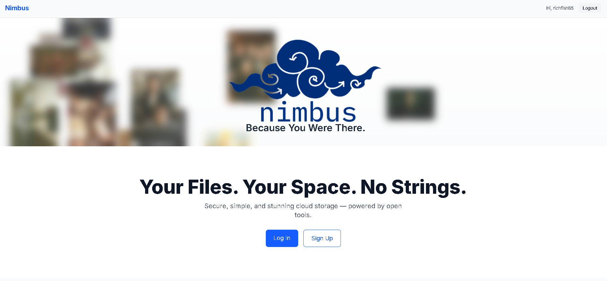
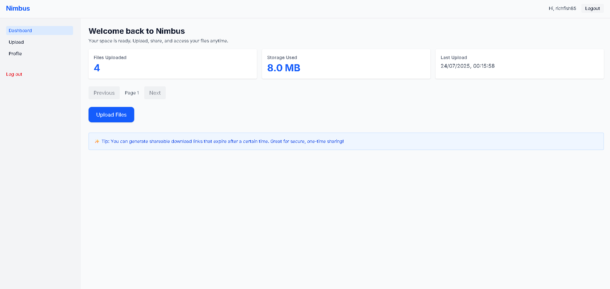
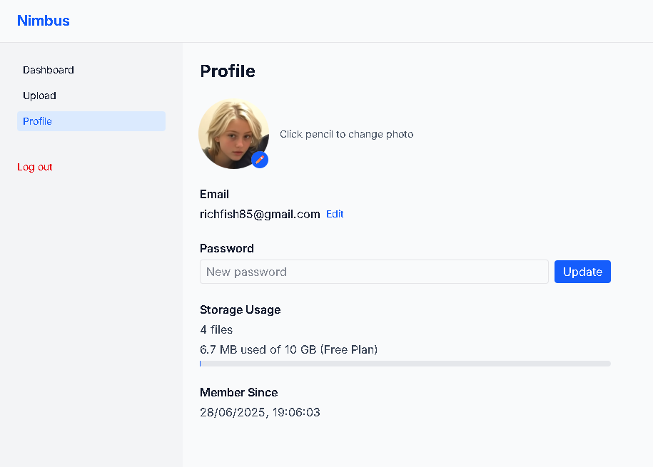

# 🌩️ Nimbus — Personal Cloud Storage Platform

Nimbus is a sleek, user-friendly cloud storage platform built with **Next.js**, **Tailwind CSS**, and **Supabase**. Designed to demonstrate secure file handling, storage management, and user account operations, Nimbus offers a strong foundation for scalable cloud-native applications.

> _“Because you were there.”_ — Nimbus tagline

---

## 🚀 Features

- **Authentication & Authorization**  
  - Secure login/logout using Supabase Auth
  - Role-based route protection (client-side guarding)

- **Cloud File Uploads & Downloads**  
  - File uploads linked to individual user folders
  - Public and signed download links
  - Storage quota indicator and usage stats

- **Dashboard with Analytics**  
  - File count, last upload date, and storage used
  - Pagination for browsing large uploads

- **Responsive UI Modes**  
  - Toggle between List, Thumbnail, and Detail views
  - Clean Tailwind CSS styling with light/dark support planned

- **User Profile Management**  
  - Editable email and password
  - Avatar upload using Supabase Storage
  - Visual upload progress and usage bar

---

## 🧰 Built With

| Tech             | Purpose                                |
|------------------|----------------------------------------|
| **Next.js 14**   | Frontend framework                     |
| **Tailwind CSS** | Modern, utility-first styling          |
| **Supabase**     | Auth, storage, and serverless backend  |
| **TypeScript**   | Type safety + scalability              |

---

## 🗂️ File Structure

/app
├─ /dashboard → Secure dashboard + stats
├─ /upload → File upload + listing UI
├─ /profile → Avatar, email, password settings
/components
├─ DashboardLayout → Sidebar + layout wrapper
├─ FileUploader → Upload logic + dropzone
├─ FileList → File view modes (list/thumb/detail)
/lib
└─ supabaseClient → Supabase singleton config
/public
└─ hero/ → Landing page visuals

---

## 🛠 Setup

> You’ll need a Supabase project with:
> - A `nimbus-uploads` bucket (private)
> - An `avatars` bucket (public or with RLS `INSERT` policy)
> - Auth enabled (email/password)

### 1. Clone + install

git clone https://github.com/richfish85/nimbus.git
cd nimbus
npm install

1. Add environment variables
Create .env.local:

env
NEXT_PUBLIC_SUPABASE_URL=your-supabase-url
NEXT_PUBLIC_SUPABASE_ANON_KEY=your-anon-key

2. Run locally
npm run dev
🧪 Roadmap
 Drag & drop file uploads

 Folder support

 Real-time sync

 Shareable file links

 Dark mode toggle

 Admin dashboard for usage oversight

📸 Screenshots

📄 License
This project is for personal and educational use. Reach out for licensing or collaboration opportunities.

✨ Author
Richard Fisher
deepnet.com.au • Medium • Aspiring Cybersecurity Engineer & Full-stack Developer